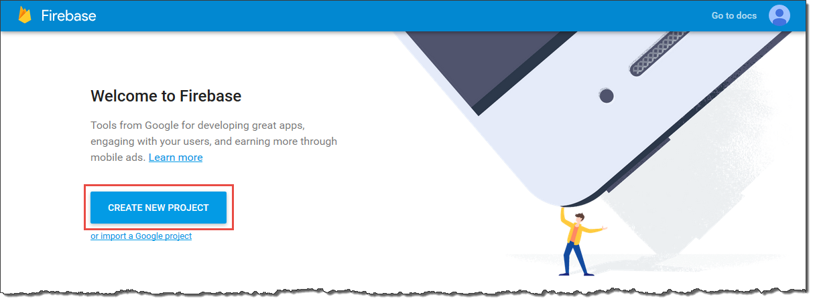
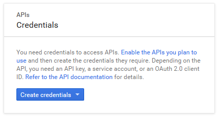
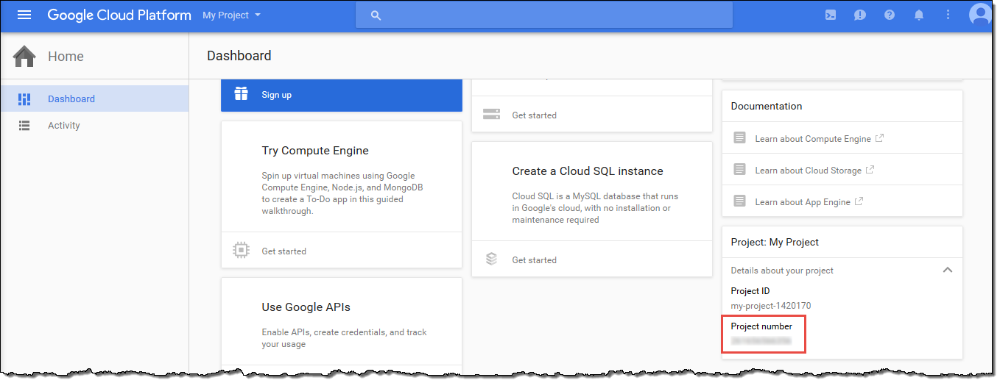

# Setting Up FCM/GCM for Push Notifications

This section describes how to obtain the credentials required to send push notifications to Android apps. The platform notification services you can use for push notifications on Android are Firebase Cloud Messaging (FCM) and its predecessor, Google Cloud Messaging (GCM). Your FCM or GCM credentials enable you to create an Android project and launch a sample app that can receive push notifications.

**Create a Firebase Project**

To send push notifications to Android apps, you must have a project that is enabled with an Android push notification service. The push notification services for Android are Firebase Cloud Messaging (FCM) and its predecessor, Google Cloud Messaging (GCM).

If you are new to push messaging on Android, you must create a Firebase project, as this topic describes. However, if you have an existing Google Cloud Messaging project that has push messaging enabled, you can skip this step and use that project instead.

**To create a Firebase project**

* Go to the Firebase console at https://console.firebase.google.com/. If you are not signed in to Google, the link takes you to a sign-in page. After you sign in, you see the Firebase console.

* Choose Create New Project.

* Type a project name, and then choose Create Project.

* Firebase projects support push messaging by default.

**Get Push Messaging Credentials for Android**

To send push notifications to Android apps, you must have credentials from either Firebase Cloud Messaging (FCM) or its predecessor, Google Cloud Messaging (GCM). The credentials are an API key and a sender ID (also called project number). You get these credentials from a project that has push messaging enabled. This project could either be in the Firebase console or the Google Cloud Platform console, depending on where you created it.

This topic describes how to retrieve your credentials from FCM or GCM. Use FCM for new Android apps. Use GCM only if you have an existing GCM project that you have not yet updated for FCM support.

**To obtain your credentials from FCM**

* Go to the Firebase console at https://console.firebase.google.com/ and open your project.

* In the left pane, to the right of your project name, choose the gear icon, and then choose Project Settings.

* In the top menu, choose Cloud Messaging.

* Under Project credentials, you find the API key and sender ID. Save these values somewhere you can access later.

**To obtain your credentials from GCM**

* Go to the Google API Console at https://console.developers.google.com.

* In the left pane, choose `Credentials`.

* If you already have credentials for your app, your server key is shown in the API keys section. Save this key somewhere you can access later.

* If you don't have credentials for your app, the console displays the Credentials dialog box. Create a server key by completing the following steps:

    * Choose Create credentials.

    

    * Save the API key somewhere you can access later.

    

* To retrieve your sender ID (also called project number), go to the Google Cloud Platform console at https://console.cloud.google.com/. Select your project from the Project menu. Then, choose the arrow next to the project name.

* Save the displayed project number somewhere you can access later.
  **Note:** Project number is another name for sender ID.

